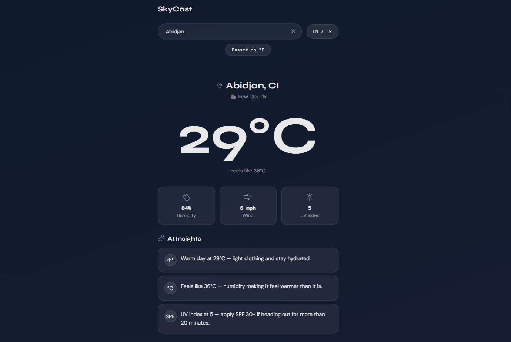
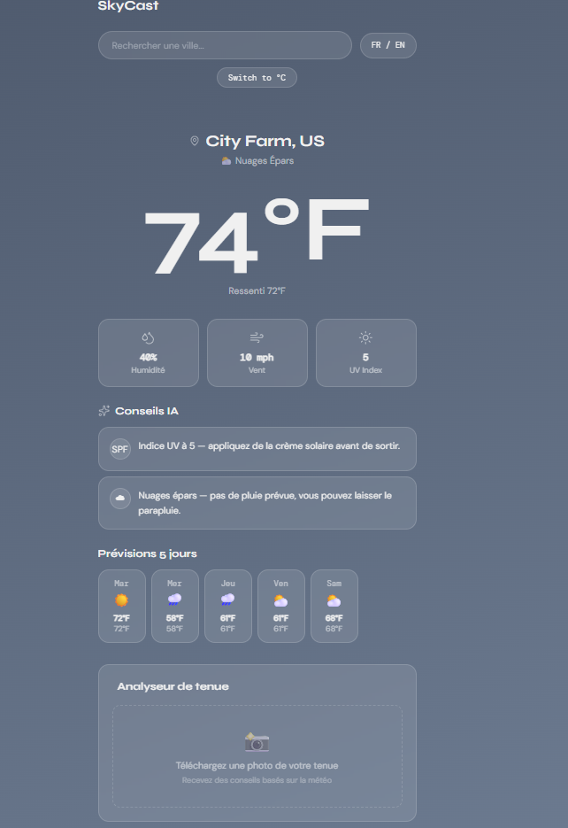
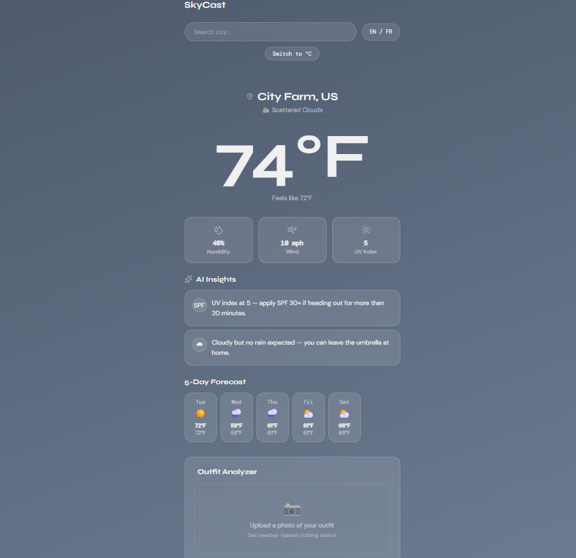
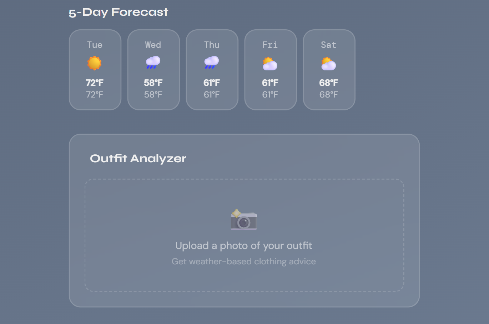
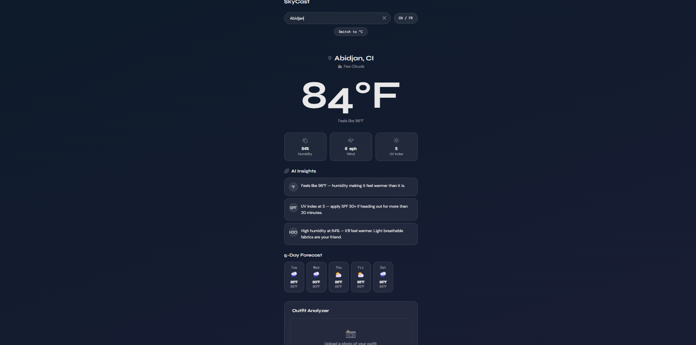

# SkyCast — Smart Weather App

> A weather app that doesn't just tell you the temperature — it tells you what to do about it. Smart contextual notifications, dynamic weather themes, bilingual support, and an AI-powered outfit analyzer.

**[Live Demo →](https://skycast.vercel.app)**

---

## Screenshots

### Celcius


### French Mode


### English Mode


### Outfit Analyzer


### Night Mode



---

## Features

- **Live weather data** — Real-time conditions and 5-day forecast powered by the OpenWeather API
- **Smart AI Insights** — Contextual notifications generated from weather parameters (UV index, humidity, wind, temperature) that give users actionable advice, not just numbers
- **Dynamic theming** — Background gradients and UI colors shift smoothly based on weather conditions (sunny, rainy, cloudy, snowy, thunderstorm, night)
- **°F / °C toggle** — Switch between Fahrenheit and Celsius instantly across all values
- **Bilingual UI (FR/EN)** — Full French and English interface including translated weather descriptions and AI insights
- **Geolocation** — Detects user location on load and falls back gracefully if permission is denied
- **Outfit Analyzer** — Upload a photo of your outfit and get weather-appropriate clothing advice
- **Framer Motion animations** — Smooth page transitions and staggered insight card animations
- **Skeleton loaders** — Polished loading states while data fetches
- **Fully responsive** — Mobile-first design optimized for all screen sizes

---

## Tech Stack

| Layer | Technology |
|-------|-----------|
| Framework | React 18 + TypeScript |
| Styling | Tailwind CSS v3 |
| Animations | Framer Motion |
| Icons | Lucide React |
| Weather Data | OpenWeather API |
| Build Tool | Vite |
| Deployment | Vercel |

---

## Design Process

The UI was designed in **Figma** before any code was written, following a design-first approach:

1. **Color system** — Defined 6 weather state themes (clear, rain, snow, thunderstorm, clouds, night) as Figma variables, each with background gradient, card, text, muted, border, and pill tokens
2. **Typography** — Syne for headings and the large temperature display (ultra-thin weight), DM Sans for body text, DM Mono for data labels — creating an editorial, modern feel
3. **Component design** — Built all UI components in Figma first: SearchBar, HeroCard, StatPills, InsightCard, ForecastStrip, OutfitAnalyzer
4. **Wireframes** — Designed mobile-first at 390px, then verified desktop layout
5. **Prototype** — Connected all states in Figma before writing a single line of code

---

## Smart Insights Engine

Rather than relying on a paid AI API, SkyCast uses a custom-built insight engine that reads real weather data and generates contextual advice:

```ts
// Example logic — UV index insight
if (uvIndex >= 8) {
  return "UV index is very high — apply SPF 50+ and wear sunglasses."
} else if (uvIndex >= 5) {
  return "UV index at ${uvIndex} — apply SPF 30+ if heading out for 20+ minutes."
}
```

This approach ensures the app is always fast, never rate-limited, and the logic is fully explainable — which is a deliberate engineering decision, not a limitation.

---

## Architecture

```
src/
├── components/
│   ├── SearchBar.tsx       # City search + language toggle
│   ├── HeroCard.tsx        # City name + big temperature display
│   ├── StatPills.tsx       # Humidity, wind, UV index pills
│   ├── InsightCard.tsx     # Single AI insight card with animation
│   ├── ForecastStrip.tsx   # Horizontally scrollable 5-day forecast
│   └── OutfitAnalyzer.tsx  # Photo upload + weather-based advice
├── hooks/
│   └── useWeather.ts       # OpenWeather API + geolocation hook
├── utils/
│   ├── weatherThemes.ts    # Dynamic color system per weather state
│   └── aiInsights.ts       # Smart notification generation engine
└── App.tsx                 # Root — state, theme, layout
```

---

## Running Locally

```bash
# Clone the repository
git clone https://github.com/Sheks17/skycast.git
cd skycast

# Install dependencies
npm install

# Add your OpenWeather API key
VITE_OPENWEATHER_KEY=your_key_here

# Start the development server
npm run dev
```

Open [http://localhost:5173](http://localhost:5173) in your browser.

Get a free OpenWeather API key at [openweathermap.org](https://openweathermap.org/api).

**Requirements:** Node.js 18+ and npm 9+

---

## Deployment

Deployed on **Vercel** with automatic redeployment on every push to `main`.

Environment variable required in Vercel dashboard:
```
VITE_OPENWEATHER_KEY=your_key_here
```

---

## What I'd Add Next

- **Hourly forecast** — Show hour-by-hour breakdown for the current day
- **Weather alerts** — Surface official severe weather warnings from the API
- **Wardrobe memory** — Save named clothing items and get personalized outfit suggestions by name
- **PWA support** — Make the app installable on mobile as a Progressive Web App
- **Push notifications** — Morning weather briefing delivered as a browser notification

---

## Author

**Shekina Uchegbulem**
[Portfolio](https://shekinauchegbulem.com) · [GitHub](https://github.com/Sheks17) · [LinkedIn](https://linkedin.com/in/shekina-uchegbulem-72a685136)

---

## License

MIT